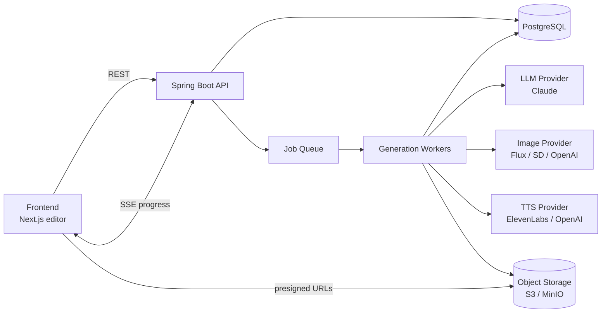
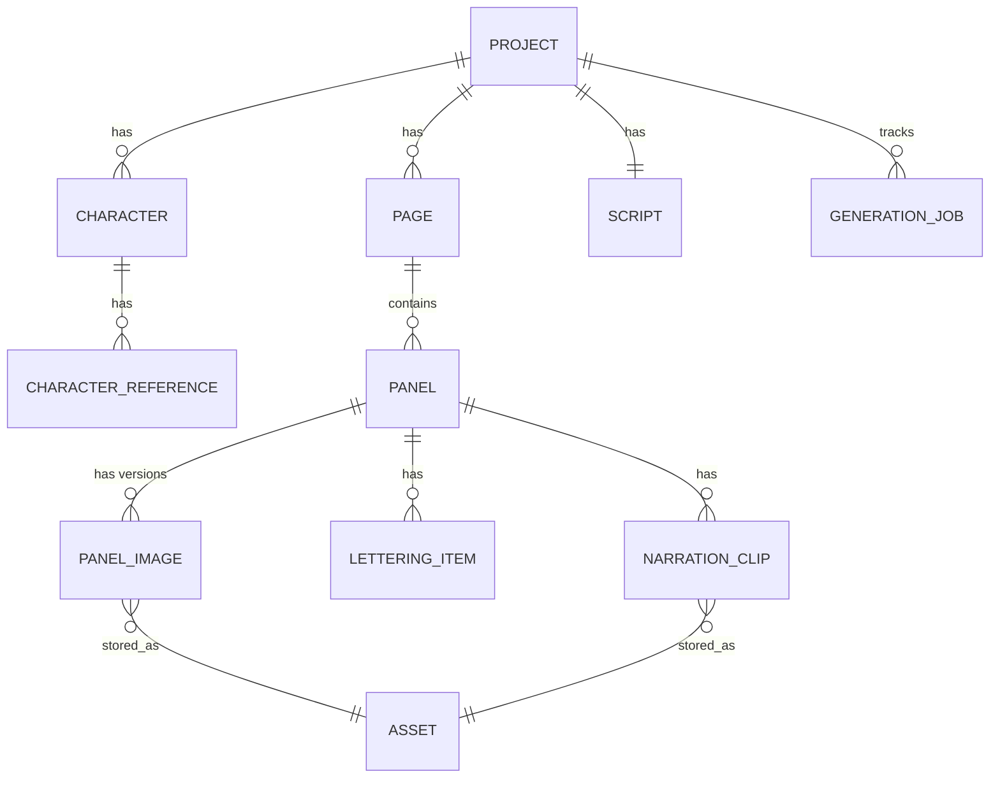
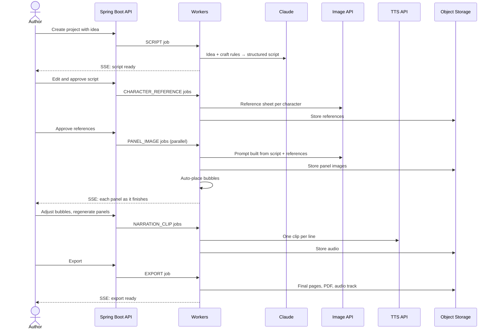

# AI Comic Strip Generator — Backend Architecture (Java + Spring Boot)

This document describes the backend for an application that lets a manga or comic author turn an idea into a finished comic strip: a script, consistent characters, panel artwork, editable speech bubbles, and voice narration. The backend is a Spring Boot service that orchestrates several external AI models, stores every intermediate result as data, and runs slow generation work in the background while streaming progress to the frontend.

---

## 1. Design Principles

**One model per job.** No single AI model can write a script, draw consistent characters, letter a page, and narrate it. The backend is an orchestrator: an LLM writes the script, an image model draws, text-to-speech narrates, and your own code handles layout and lettering.

**The script is the backbone.** The LLM's output is a strongly typed script (characters, panels, dialogue, narration). Every later stage reads from it, so the author can edit the script and regenerate only what changed.

**Everything is data, nothing is baked in.** Speech bubbles are stored as coordinates and text, not burned into images. Images and audio live in object storage and are referenced by ID. This makes any single panel, bubble, or voice line regenerable and editable.

**The author stays in control.** Every stage has an approval point: approve the script, approve the character designs, then generate panels, then adjust bubbles, then narrate.

**Slow work is asynchronous.** Image generation can take 10 to 60 seconds per panel. HTTP requests only create jobs; workers do the generation; the frontend receives progress over Server-Sent Events.

**Providers are swappable.** Image and voice models change constantly. Each provider sits behind a Java interface so you can switch from one image API to another without touching business logic.

---

## 2. High-Level Architecture



The frontend never talks to AI providers directly. It calls the Spring Boot API, which saves state in PostgreSQL and enqueues jobs. Workers call the providers, upload generated images and audio to object storage, update the database, and publish progress events. The frontend loads images and audio straight from storage using short-lived presigned URLs.

For the MVP, the API and workers can be the same Spring Boot application, with workers running on a background thread pool. They can be split into separate deployments later without changing the code structure.

---

## 3. Technology Stack

| Concern | Choice | Notes |
|---|---|---|
| Language / runtime | Java 21 | Virtual threads suit I/O-heavy API orchestration |
| Framework | Spring Boot 3.x | Web, Data JPA, Validation, Security, Actuator |
| LLM integration | Spring AI (Anthropic starter) or Anthropic Java SDK | Structured output mapped to Java records |
| Image generation | Hosted API via `RestClient` / `WebClient` | Replicate, fal, or OpenAI Images behind an interface |
| Text-to-speech | Hosted API via `RestClient` | ElevenLabs or OpenAI TTS behind an interface |
| Database | PostgreSQL + Flyway | Relational data plus JSONB for flexible script fields |
| Object storage | AWS S3 (MinIO locally) | Images, audio, exports |
| Background jobs | `@Async` + DB job table (MVP), SQS or RabbitMQ (later) | Retries, status tracking |
| Real-time progress | Server-Sent Events (`SseEmitter`) | Simpler than WebSockets for one-way updates |
| Resilience | Resilience4j | Retries, timeouts, rate limiting, circuit breakers |
| Image composition | Java2D (`Graphics2D`) | Final page export with lettering |
| Audio stitching | FFmpeg (invoked via `ProcessBuilder`) | Concatenate voice lines into one track |
| Testing | JUnit 5, WireMock, Testcontainers | Mock providers, real Postgres in tests |
| Local dev | Docker Compose | Postgres, MinIO |

---

## 4. Project Structure

Organize the code by feature rather than by technical layer. Each feature package owns its controller, service, entities, and repository, which keeps related code together and makes it easy to extract a feature into its own service later.

```
com.example.comicstudio
├── project/        # Comic projects (the top-level container)
├── script/         # Idea → script generation, script editing, validation
├── character/      # Characters and reference sheets
├── panel/          # Panel prompts, panel image generation
├── lettering/      # Speech bubbles, captions, auto-placement
├── narration/      # Voice casting, TTS, audio stitching
├── export/         # Final page rendering (PNG/PDF) and audio export
├── job/            # Job table, orchestration, workers, retries
├── progress/       # SSE event publishing
├── asset/          # Object storage, presigned URLs
├── provider/
│   ├── llm/        # LlmClient interface + Claude adapter
│   ├── image/      # ImageGenerator interface + adapters
│   └── tts/        # SpeechSynthesizer interface + adapters
├── usage/          # Cost tracking and quotas
└── common/         # Config, security, error handling, shared utilities
```

---

## 5. Domain Model

The domain mirrors how a comic is actually built: a project has characters and pages, pages have panels, and panels have lettering (bubbles and captions) and narration.



### Core tables

| Table | Key columns | Purpose |
|---|---|---|
| `project` | id, owner_id, title, idea, style_preset, reading_direction, status | Top-level container; reading direction is `RTL` for manga, `LTR` for western comics |
| `script` | id, project_id, version, content (JSONB), approved | The LLM-generated and author-edited script; versioned so edits can be undone |
| `character` | id, project_id, name, visual_description, personality, voice_id | Canonical description reused in every image prompt |
| `character_reference` | id, character_id, asset_id, approved, seed | The approved reference sheet used for consistency |
| `page` | id, project_id, page_number, layout_template | Which panel grid the page uses |
| `panel` | id, page_id, panel_index, scene_description, shot_type, characters_in_panel, current_image_id | One panel's intent, as written in the script |
| `panel_image` | id, panel_id, asset_id, prompt, seed, provider, model, created_at | Every generated version, so the author can revert |
| `lettering_item` | id, panel_id, type, speaker_character_id, text, x, y, width, height, tail_x, tail_y, reading_order | Speech bubbles, thought bubbles, captions, and SFX as editable data |
| `narration_clip` | id, panel_id, lettering_item_id, voice_id, text, asset_id, duration_ms | One audio clip per narration line or spoken dialogue line |
| `generation_job` | id, project_id, type, target_id, status, attempts, error, cost_cents, created_at, finished_at | Every async task and its outcome |
| `asset` | id, storage_key, content_type, size_bytes, checksum | Pointer to a file in object storage |
| `usage_record` | id, user_id, provider, units, cost_cents, job_id | Cost tracking per user and job |

Bubble coordinates (`x`, `y`, `width`, `height`, tail position) are stored as **normalized values from 0 to 1** relative to the panel. That way bubbles stay correctly placed when the panel is displayed at any size or the image is regenerated at a different resolution.

### The script as Java records

The script is the contract between the LLM and the rest of the system. Defining it as records lets Spring AI map the model's JSON output directly into typed objects.

```java
public record ComicScript(
        String title,
        String logline,
        List<CharacterSpec> characters,
        List<PageSpec> pages) {}

public record CharacterSpec(
        String name,
        String visualDescription,   // hair, eyes, build, outfit: reused in every prompt
        String personality,
        String voiceDescription) {} // used to pick a TTS voice

public record PageSpec(int pageNumber, List<PanelSpec> panels) {}

public record PanelSpec(
        int panelIndex,
        String sceneDescription,
        ShotType shotType,          // WIDE, MEDIUM, CLOSE_UP, EXTREME_CLOSE_UP
        List<String> charactersInPanel,
        List<DialogueSpec> dialogue,
        String narration,           // caption box text, may be null
        String soundEffect) {}      // e.g. "BAM", may be null

public record DialogueSpec(String speaker, String text, BubbleType type) {}

public enum ShotType { WIDE, MEDIUM, CLOSE_UP, EXTREME_CLOSE_UP }
public enum BubbleType { SPEECH, THOUGHT, SHOUT, WHISPER }
```

---

## 6. REST API

HTTP endpoints are fast: anything that calls an AI model returns `202 Accepted` with a job ID, and the result arrives later through SSE or by polling the job.

| Method | Endpoint | Behavior |
|---|---|---|
| `POST` | `/api/projects` | Create a project from an idea, style, and page count |
| `GET` | `/api/projects/{id}` | Full project state: script, characters, pages, panels, bubbles |
| `POST` | `/api/projects/{id}/script/generate` | Start script generation (async) |
| `PUT` | `/api/projects/{id}/script` | Save the author's edits as a new script version |
| `POST` | `/api/projects/{id}/script/approve` | Lock the script and create characters, pages, and panels from it |
| `POST` | `/api/characters/{id}/reference/generate` | Generate reference sheet options (async) |
| `POST` | `/api/characters/{id}/reference/{refId}/approve` | Choose the reference used for all panels |
| `POST` | `/api/projects/{id}/panels/generate` | Generate all panel images (async, one job per panel) |
| `POST` | `/api/panels/{id}/regenerate` | Regenerate one panel, optionally with an edited prompt |
| `POST` | `/api/panels/{id}/images/{imageId}/select` | Revert to an earlier version |
| `PATCH` | `/api/lettering/{id}` | Move, resize, or edit a bubble |
| `POST` | `/api/panels/{id}/lettering/auto-place` | Re-run automatic bubble placement |
| `POST` | `/api/projects/{id}/narration/generate` | Generate all voice clips (async) |
| `PUT` | `/api/characters/{id}/voice` | Change a character's voice |
| `POST` | `/api/projects/{id}/export` | Render final pages and audio (async) |
| `GET` | `/api/jobs/{id}` | Job status (polling fallback) |
| `GET` | `/api/projects/{id}/events` | SSE stream of progress events |

---

## 7. Components in Detail

### 7.1 Provider Layer (Ports and Adapters)

Everything that talks to an external AI service sits behind an interface. Business logic depends on the interface; adapters implement it for a specific vendor. Switching image models becomes a configuration change, and tests can use fake implementations.

```java
public interface ImageGenerator {
    GeneratedImage generate(ImageRequest request);
}

public record ImageRequest(
        String prompt,
        String negativePrompt,
        List<byte[]> referenceImages,  // character reference sheets, if supported
        int width,
        int height,
        Long seed) {}

public record GeneratedImage(byte[] data, String contentType, Long seed, String model, int costCents) {}

public interface SpeechSynthesizer {
    SynthesizedAudio synthesize(String text, String voiceId, VoiceSettings settings);
}
```

Adapters such as `ReplicateImageGenerator`, `OpenAiImageGenerator`, and `ElevenLabsSpeechSynthesizer` handle each vendor's HTTP details. Many image APIs are asynchronous themselves (you submit a prediction, then poll or receive a webhook), so the adapter hides that and returns a finished image to the caller. Select the active adapter with a property such as `comic.providers.image=replicate` and a `@ConditionalOnProperty` bean.

Wrap every adapter call with Resilience4j: a timeout, a retry with exponential backoff for `429` and `5xx` responses, and a rate limiter matched to your plan's limits. Provider outages are common, and a single failed panel should retry quietly instead of failing the whole strip.

### 7.2 Script Service

The script service turns a short idea into a `ComicScript`. It builds a system prompt describing comic writing conventions, calls the LLM with structured output, validates the result, and saves it as a new script version.

```java
@Service
public class ScriptGenerationService {

    private final ChatClient chatClient;

    public ComicScript generate(ScriptRequest req) {
        return chatClient.prompt()
                .system(ScriptPrompts.SYSTEM)
                .user(u -> u.text(ScriptPrompts.USER)
                        .param("idea", req.idea())
                        .param("pages", req.pageCount())
                        .param("panelsPerPage", req.panelsPerPage())
                        .param("style", req.stylePreset()))
                .call()
                .entity(ComicScript.class);
    }
}
```

The system prompt should encode the craft rules that make comics readable: keep dialogue under about 25 words per bubble, no more than two or three bubbles per panel, vary shot types, end each page on a small hook, and describe each scene visually (what the camera sees) rather than emotionally. Ask for character visual descriptions that are concrete and stable ("short black hair with a white streak, red scarf, round glasses") because those descriptions get reused in every image prompt.

After generation, run validation in code, not just in the prompt: check that every speaker exists in the character list, that panel counts match the request, and that dialogue length limits hold. If validation fails, send the errors back to the LLM for one repair attempt before surfacing the problem to the author.

The author can then edit any part of the script. Each save creates a new `script` version, and approval converts the script into `character`, `page`, `panel`, and `lettering_item` rows.

### 7.3 Character Service

Character consistency is the hardest problem in the whole system, and the character service exists to solve it. For each character, it generates a few reference sheet options (front view, neutral pose, plain background, full body) from the character's visual description and the project's style preset. The author picks one, and that approved image plus its seed and description become the character's canonical identity.

Every panel prompt then reuses three things: the exact same visual description text, the approved reference image (for providers that accept image inputs), and a consistent style block. For stronger consistency later, look into image models that support reference-image conditioning or editing, or train a small LoRA per character. Design the `character_reference` table so you can attach those artifacts without schema changes.

### 7.4 Panel Generation Service

This service turns each `panel` row into artwork. Its most important piece is the **prompt builder**, a plain Java class that deterministically assembles prompts from structured data rather than asking the LLM to freewrite them.

```java
public String buildPrompt(Project project, Panel panel, List<Character> cast) {
    return String.join(", ",
            project.stylePreset().promptFragment(),           // e.g. "black and white manga, screentone shading, clean ink lines"
            panel.shotType().promptFragment(),                // e.g. "close-up shot"
            cast.stream().map(Character::visualDescription).collect(joining("; ")),
            panel.sceneDescription(),
            "no text, no speech bubbles, no lettering");       // lettering is added by the backend
}
```

Because the prompt is built from data, the result is reproducible, easy to debug, and consistent across panels. Store the full prompt, seed, provider, and model on every `panel_image` row so you can see exactly why an image looks the way it does and regenerate it faithfully.

Two rules matter here. First, always instruct the model not to draw text, because image models garble lettering; the backend adds all text as bubbles. Second, reserve space for bubbles by adding composition hints such as "negative space at top of frame" when a panel has dialogue.

Each panel is generated as its own job, so panels render in parallel and a failure affects only one panel. Regenerating a panel creates a new `panel_image` version rather than overwriting, so the author can always go back.

### 7.5 Lettering Service

Lettering covers speech bubbles, thought bubbles, caption boxes for narration, and sound effects. Every item is a `lettering_item` row with normalized coordinates, so the frontend renders bubbles as editable overlays and the author can drag, resize, and rewrite them.

When a panel image is ready, the lettering service proposes initial placements. A simple MVP heuristic works well: place bubbles along the top of the panel in reading order (right to left for manga, left to right for western comics), put narration captions in a corner, and point each bubble's tail toward the speaker's approximate position. A stronger version sends the finished panel image to a vision-capable LLM such as Claude and asks it to return empty regions and each character's position as JSON, which you then use to place bubbles and tails. Either way, placement is only a starting point for the author.

The lettering service also sizes bubbles by measuring text with `java.awt.FontMetrics`, wrapping lines to fit a target width, so bubbles fit their text before the author touches them.

### 7.6 Narration Service

Narration turns captions and dialogue into audio. The flow has three parts.

**Voice casting.** Each character gets a `voice_id`. The service can suggest voices by matching the script's `voiceDescription` against the provider's voice catalog, and the author can override the choice. A separate narrator voice reads caption boxes.

**Clip synthesis.** Each narration line and dialogue line becomes its own `narration_clip`, generated by the `SpeechSynthesizer`. Storing clips individually means editing one line regenerates one clip, not the whole track. Record each clip's duration.

**Assembly.** For playback, the frontend can play clips in reading order and highlight the current panel using the stored durations. For export, the service concatenates clips with short pauses between panels into a single audio file using FFmpeg, and produces a timing file (panel ID to start and end time) that can drive a motion-comic style playback or video export later.

### 7.7 Job Orchestration

Every AI call runs as a `generation_job`. The job table is the source of truth for what is happening, which makes the system observable, retryable, and resilient to restarts.

```java
public enum JobType { SCRIPT, CHARACTER_REFERENCE, PANEL_IMAGE, LETTERING_LAYOUT, NARRATION_CLIP, EXPORT }
public enum JobStatus { QUEUED, RUNNING, SUCCEEDED, FAILED, CANCELLED }
```

The lifecycle is: a controller inserts a job as `QUEUED` and returns its ID; a worker claims it (using `SELECT ... FOR UPDATE SKIP LOCKED` so multiple workers never grab the same job), marks it `RUNNING`, calls the relevant service, stores results, and marks it `SUCCEEDED` or `FAILED` with the error message. Failed jobs retry up to a limit with backoff before staying failed and notifying the author.

For the MVP, a scheduled poller plus an `@Async` executor is enough, and enabling virtual threads (`spring.threads.virtual.enabled=true`) lets many jobs wait on slow provider calls cheaply. When you need more scale or durability, replace the poller with SQS or RabbitMQ; because the job table and services stay the same, only the dispatch mechanism changes.

Make jobs idempotent: a panel job should check whether the panel already has a newer image before writing, so duplicate deliveries or retries never overwrite newer work.

Stage dependencies are enforced by state checks rather than a complex workflow engine. Panel generation requires an approved script and approved character references; narration requires approved script text; export requires all panels to have a selected image.

### 7.8 Progress Streaming

The frontend opens `GET /api/projects/{id}/events` and receives Server-Sent Events whenever a job changes state, for example `{"type":"PANEL_IMAGE","panelId":42,"status":"SUCCEEDED","imageUrl":"..."}`. Workers publish events through a small `ProgressPublisher` that holds `SseEmitter` instances per project. SSE fits this use case better than WebSockets because updates only flow from server to client and it works over plain HTTP.

If you run multiple backend instances, workers on one instance need to reach emitters on another. Route events through Postgres `LISTEN/NOTIFY` or Redis pub/sub at that point. The `/api/jobs/{id}` endpoint remains as a polling fallback.

### 7.9 Asset Service

The asset service wraps S3 (or MinIO locally). It uploads generated bytes under structured keys such as `projects/{projectId}/panels/{panelId}/{imageId}.png`, records an `asset` row, and hands the frontend **presigned URLs** that expire after a short time. The bucket stays private; nothing is publicly listable. Put CloudFront in front of the bucket when you deploy for faster image loading.

### 7.10 Export Service

Export produces the final deliverables. For pages, it composes panel images into the page's layout template with gutters and borders using `Graphics2D`, then draws each lettering item (bubble shape, tail, wrapped text in a comic font) at its normalized position scaled to the output resolution. Output formats are PNG per page and a combined PDF. For audio, it runs the FFmpeg assembly from the narration service. Export runs as a job because rendering high-resolution pages takes time.

### 7.11 Usage and Cost Tracking

Image and voice generation cost real money on every call, so track it from day one. Each adapter reports the cost of its call (from the provider's response or a price table in configuration), and the job writes a `usage_record`. This gives you cost per strip, cost per user, and the data to enforce quotas, such as a monthly panel limit per user, before a runaway loop or an abusive user drains your account.

### 7.12 Security and Safety

Use Spring Security with JWT (or a hosted auth provider) and check ownership on every project-scoped endpoint. Keep all provider API keys server-side in environment variables or AWS Secrets Manager; the frontend never sees them. Rate limit generation endpoints per user.

Plan for content moderation. Image providers have their own safety filters and will sometimes refuse a prompt, so adapters should map refusals to a clear `CONTENT_REJECTED` job error the author can act on rather than a generic failure. Consider a lightweight LLM check on the idea and script before generating images, and avoid generating recognizable copyrighted characters, which is both a legal risk and something many providers block.

---

## 8. End-to-End Flow



---

## 9. Configuration

Keep provider choice, models, and limits in configuration so they can change without code changes.

```yaml
spring:
  threads:
    virtual:
      enabled: true
  ai:
    anthropic:
      api-key: ${ANTHROPIC_API_KEY}
      chat:
        options:
          model: claude-sonnet-5

comic:
  providers:
    image: replicate        # replicate | openai | fal
    tts: elevenlabs         # elevenlabs | openai
  generation:
    max-panels-per-page: 6
    max-attempts: 3
    panel-width: 1024
    panel-height: 1024
  quotas:
    panels-per-month: 200
  storage:
    bucket: comic-studio-assets
    presigned-url-ttl: 15m
```

---

## 10. Observability

Log every job with its project ID, job ID, provider, model, latency, and cost using structured JSON logs and MDC. Expose metrics through Spring Boot Actuator and Micrometer: job duration by type, failure rate by provider, queue depth, and daily spend. These three questions should always be answerable: which provider is failing right now, how long does a full strip take, and how much did today cost.

---

## 11. Testing Strategy

**Unit tests** cover the deterministic parts: the prompt builder, script validation, bubble sizing and placement, and job state transitions. These are where most bugs hide and they are easy to test.

**Provider adapters** are tested with WireMock, stubbing each vendor's API including rate-limit responses, timeouts, and content refusals, so you can verify retries and error mapping without spending money.

**Integration tests** use Testcontainers for real PostgreSQL and MinIO, and fake `ImageGenerator` and `SpeechSynthesizer` beans that return fixture images and audio. This lets you run the entire pipeline end to end in CI.

**LLM evals** are a small set of saved ideas run through script generation, with automated checks on the output (valid structure, dialogue limits, speakers exist, shot variety). Run them whenever you change prompts or models. This is exactly the kind of evaluation work AI companies care about.

---

## 12. Local Development and Deployment

Locally, Docker Compose runs PostgreSQL and MinIO, and the Spring Boot app runs from your IDE with a `local` profile. A `fake` provider profile swaps in the fixture adapters so you can develop the UI and pipeline without API costs.

For deployment on AWS, a straightforward setup is the Spring Boot app in a Docker container on ECS Fargate or App Runner, RDS for PostgreSQL, S3 plus CloudFront for assets, Secrets Manager for API keys, and SQS once you move off the database-polling queue. FFmpeg should be installed in the Docker image for audio export.

---

## 13. Suggested Build Order

| Phase | Deliverable | What it proves |
|---|---|---|
| 1 | Project creation and script generation with structured output, editing, and versioning | LLM integration and typed outputs |
| 2 | Job table, async workers, SSE progress | Background orchestration |
| 3 | Character references and panel generation with the prompt builder, one image provider | Multi-model pipeline and consistency |
| 4 | Lettering as data with heuristic auto-placement | Editable, author-controlled output |
| 5 | Narration with per-character voices and clip playback | Third modality |
| 6 | Export to PNG, PDF, and audio track | End-to-end product |
| 7 | Cost tracking, quotas, retries, observability, evals | Production readiness |

A good MVP target is one page, four panels, two characters, speech bubbles, and a single narrator voice. Get that working end to end before adding more page layouts, multiple voices, vision-based bubble placement, or video export.

---

## 14. Future Extensions

Once the core works, natural next steps include vision-based bubble placement, per-character LoRA training for stronger consistency, motion-comic video export using the narration timing file, translation of lettering into other languages (easy because text is stored as data), and extracting script generation into a small Python FastAPI service to add Python to your portfolio and practice a realistic microservice boundary.
